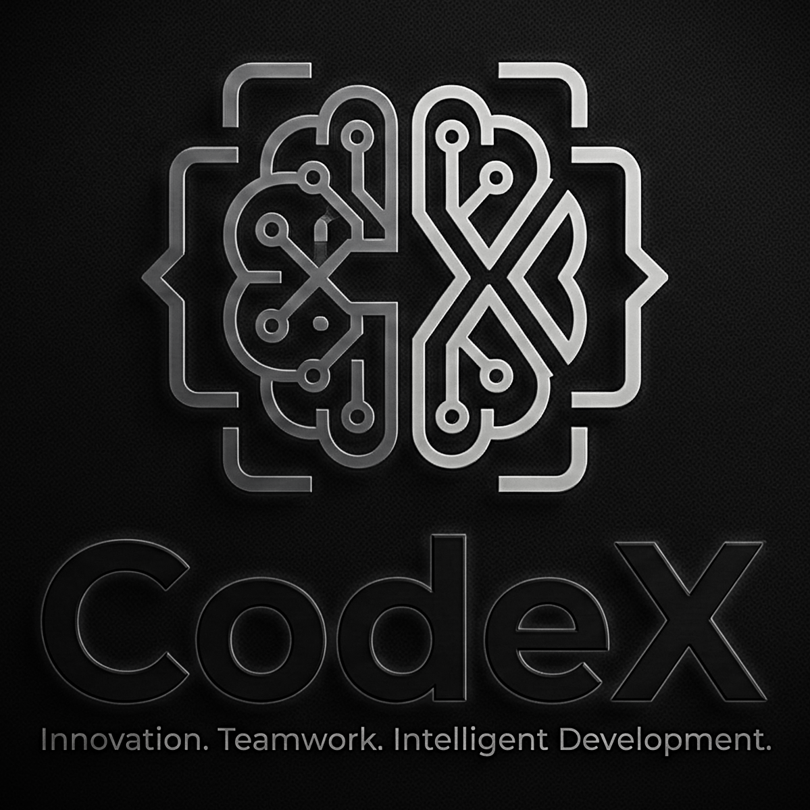
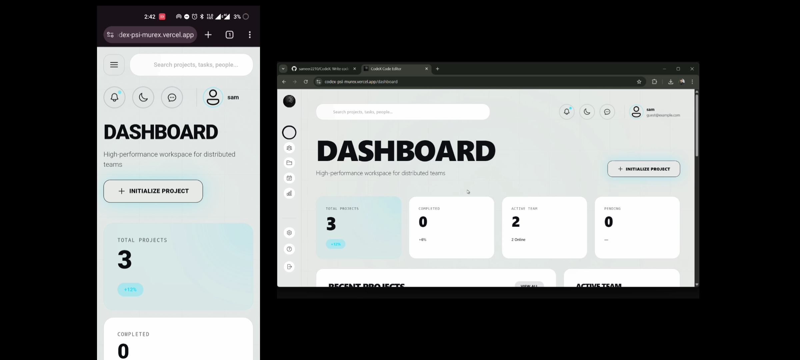
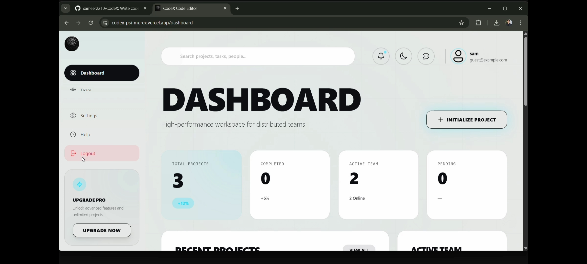

# CodeX - Collaborative AI-Powered Code Editor

<p align="center">
  
</p>

## Project Overview

CodeX is a real-time collaborative code editor with AI-assisted reviews, live chat, team presence, and WebRTC calling. Teams can edit code together, run JavaScript snippets, and get instant feedback in shared project rooms.

[](https://reactjs.org/)
[](https://nodejs.org/)
[](https://socket.io/)
[](https://ai.google.dev/)

## Live link - https://codex-psi-murex.vercel.app/

## 🎥 Demo Video

<p align="center">
  <iframe
    width="800"
    height="450"
    src="https://www.youtube.com/embed/gB7qztH9BIg"
    title="CodeX Demo Video"
    frameborder="0"
    allow="accelerometer; autoplay; clipboard-write; encrypted-media; gyroscope; picture-in-picture; web-share"
    allowfullscreen
  ></iframe>
</p>

## 📸 Screenshots

<p align="center">
  
  
</p>
<p align="center">
  
  
</p>

## 🏗️ Project Architecture

```
CodeX/
├── Backend/                  # Node.js + Express server
│   ├── server.js
│   └── src/
│       ├── app.js
│       ├── config/
│       │   └── config.js
│       ├── controllers/
│       │   ├── auth.controllers.js
│       │   ├── message.controllers.js
│       │   └── project.controllers.js
│       ├── db/
│       │   └── db.js
│       ├── middlewares/
│       │   └── authMiddleware.js
│       ├── models/
│       │   ├── message.model.js
│       │   ├── project.model.js
│       │   └── team.model.js
│       ├── routes/
│       │   ├── auth.routes.js
│       │   ├── message.routes.js
│       │   ├── project.routes.js
│       │   └── webrtc.routes.js
│       ├── services/
│       │   ├── ai.service.js
│       │   ├── auth.service.js
│       │   ├── call.service.js
│       │   ├── message.service.js
│       │   └── project.service.js
│       └── tests/
│           ├── auth.test.js
│           └── project.test.js
├── Frontend/                 # React + Vite application
│   ├── index.html
│   ├── vite.config.js
│   └── src/
│       ├── App.jsx
│       ├── main.jsx
│       ├── index.css
│       ├── api/
│       │   ├── config.jsx
│       │   └── project.api.js
│       ├── components/
│       │   ├── CallingPage.jsx
│       │   ├── ErrorBoundary.jsx
│       │   ├── HUD.jsx
│       │   ├── layout/
│       │   │   ├── Layout.jsx
│       │   │   ├── Navigation.jsx
│       │   │   └── Sidebar.jsx
│       │   ├── page/
│       │   │   ├── ActiveMember.jsx
│       │   │   ├── ActiveMemberPage.jsx
│       │   │   ├── Help.jsx
│       │   │   ├── Meeting.jsx
│       │   │   ├── Notification.jsx
│       │   │   └── Settings.jsx
│       │   └── ui/
│       │       ├── Button.jsx
│       │       └── ResizableContainer.jsx
│       ├── context/
│       │   └── ThemeContext.jsx
│       ├── lib/
│       │   ├── notify.js
│       │   └── sounds.js
│       ├── routes/
│       │   └── Routes.jsx
│       ├── services/
│       │   └── dashboardService.jsx
│       ├── store/
│       │   ├── hooks.js
│       │   ├── socketMiddleware.js
│       │   ├── store.js
│       │   └── slices/
│       │       ├── authSlice.js
│       │       ├── callSlice.js
│       │       ├── projectSlice.js
│       │       └── socketSlice.js
│       ├── tests/
│       │   ├── Login.test.jsx
│       │   └── setup.js
│       ├── views/
│       │   ├── Dashboard.jsx
│       │   ├── Landing.jsx
│       │   ├── NotFound.jsx
│       │   ├── auth/
│       │   │   ├── Login.jsx
│       │   │   └── Register.jsx
│       │   ├── create-project/
│       │   │   └── CreateProject.jsx
│       │   └── home/
│       │       └── project/
│       │           ├── Project.jsx
│       │           └── components/
│       │               ├── ChatSection.jsx
│       │               ├── CodeEditor.jsx
│       │               ├── OutputPanel.jsx
│       │               └── ReviewPanel.jsx
│       └── webrtc/
│           ├── callManager.js
│           ├── media.js
│           └── peer.js
├── public/
│   ├── code.png
│   ├── codeXDemo.mp4
│   ├── dashboard.png
│   ├── demo.png
│   ├── logo.png
│   ├── logout.png
│   └── og-image.png
├── tests/
│   ├── playwright.config.js
│   ├── e2e/
│   │   └── flow.spec.js
│   └── load/
│       └── simulation.js
├── package.json
└── Readme.md
```

## Technology Stack

### Backend Technologies

- Node.js
- Express.js
- MongoDB + Mongoose
- Socket.io
- Google Generative AI (Gemini)
- JWT authentication
- WebRTC signaling + STUN/TURN discovery
- Helmet, CORS, Morgan

### Frontend Technologies

- React 19 + Vite
- Tailwind CSS
- Redux Toolkit + Redux Persist
- React Router DOM
- Monaco Editor
- Socket.io Client
- Framer Motion
- React Hook Form + Yup
- Recharts
- WebRTC (peer connections, media devices)

### Testing

- Jest + Supertest (Backend)
- Vitest + Testing Library (Frontend)
- Playwright (E2E)

## 💡 Key Features

### 1. Real-time Collaboration

- Live code sync across project rooms
- Instant updates using Socket.io
- Team presence with active user lists

### 2. AI-Powered Code Review

- Google Gemini AI analysis
- Best-practice suggestions and feedback
- Review panel with markdown output

### 3. Built-in Code Execution

- Run JavaScript snippets in a sandboxed VM
- Output panel for stdout and errors

### 4. WebRTC Audio/Video Calls

- Team-to-team or 1:1 calls
- ICE server discovery via `/api/webrtc/turn`
- Live call status and notifications

### 5. Team Communication

- Live chat with history
- Typing indicators
- Notifications and activity tracking

## 🔄 How It Works

### 1. Project Creation & Access

```
User → /api/auth/login → JWT → /api/projects/create → Project Created
```

### 2. Real-time Collaboration

```
Editor changes → Socket.io (code-change) → Synced to project room
Chat message → Socket.io (chat-message) → Stored in MongoDB
```

### 3. AI Code Review

```
Get Review → /api/projects/:id/review or socket event → Gemini → Review Panel
```

### 4. Code Execution

```
Run Code → /api/projects/:id/execute → Node VM → Output Panel
```

### 5. WebRTC Calls

```
Start Call → Socket.io signaling → /api/webrtc/turn → Peer connection
```

## 🛣️ API Routes & Endpoints

### Auth (`/api/auth`)

- **POST** `/register` - Team registration
- **POST** `/login` - Login
- **GET** `/verify` - Verify token
- **POST** `/logout` - Logout
- **GET** `/team/:teamName/members` - Team members
- **PUT** `/team/:teamName/member/:username/activity` - Update member activity
- **GET** `/team/:teamName/messages` - Team messages

### Projects (`/api/projects`)

- **POST** `/create` - Create project
- **GET** `/get-all` - List projects
- **GET** `/:id` - Get project
- **PUT** `/:id` - Update project (code)
- **POST** `/:id/execute` - Execute JavaScript code
- **POST** `/:id/review` - AI review

### Messages (`/api/messages`)

- **GET** `/project/:projectId` - Project chat history
- **GET** `/project/:projectId/unread` - Unread count

### WebRTC (`/api/webrtc`)

- **GET** `/turn` - ICE server configuration

### Socket.io Events (Selected)

- `join-project`, `leave-project`
- `chat-history`, `chat-message`
- `typing-start`, `typing-stop`
- `code-change`
- `get-review`, `code-review`
- `user-online`, `user-offline`, `team-presence`, `active-users`
- `call:initiate`, `call:accept`, `call:reject`, `call:end`, `call:ice-candidate`

## 📱 Frontend Routes

- `/` - Landing
- `/login` - Login
- `/register` - Register
- `/dashboard` - Dashboard
- `/projects` - Project list
- `/create-project` - Create project
- `/project/:id` - Project workspace
- `/meeting` - Meeting lobby
- `/meeting/:projectId` - Project meeting
- `/active-members` - Active members
- `/settings` - Settings
- `/help` - Help
- `/notifications` - Notifications
- `/not-found` - 404 page

## 🔌 Database Models

### Project Model

```javascript
{
  name: String (required),
  teamName: String (required),
  code: String (default: ""),
  review: String (default: ""),
  timestamps: true
}
```

### Message Model

```javascript
{
  projectId: ObjectId (Project),
  teamName: String,
  username: String,
  message: String,
  type: "user" | "system" | "notification",
  metadata: { edited, editedAt, replyTo },
  timestamps: true
}
```

### Team Model

```javascript
{
  teamName: String (unique),
  password: String (hashed),
  members: [{ username, isAdmin, lastLogin, joinedAt, isActive }],
  createdAt: Date,
  updatedAt: Date
}
```

## 🚀 Getting Started

### Prerequisites

- Node.js (v18 or higher)
- MongoDB database
- Google Gemini API key

### Backend Setup

```bash
cd Backend
npm install
npm start
```

### Frontend Setup

```bash
cd Frontend
npm install
npm run dev
```

### Environment Variables

Create a `.env` file in `Backend/`:

```env
PORT=8000
MONGODB_URI=your_mongodb_connection_string
JWT_SECRET=your_jwt_secret
GOOGLE_API_KEY=your_gemini_api_key
FRONTEND_URLS=http://localhost:5173,https://your-frontend-domain.com
STUN_URLS=stun:stun.l.google.com:19302
TURN_URLS=turn:your-turn-host:3478?transport=udp,turn:your-turn-host:3478?transport=tcp
TURN_USERNAME=your_turn_username
TURN_CREDENTIAL=your_turn_credential
```

Create a `.env` file in `Frontend/`:

```env
VITE_BACKEND_URL=http://localhost:8000
```

## 🔧 Development Workflow

### 1. Project Creation

1. User navigates to `/create-project`
2. Enters project name
3. Backend creates MongoDB document
4. User is redirected to project workspace

### 2. Collaborative Coding

1. Multiple users join the same project
2. Each user connects via Socket.io
3. Code changes are broadcasted to all users
4. Chat messages are synchronized in real-time

### 3. AI Code Review

1. Developer clicks "Get Review"
2. Current code is sent to Gemini AI service
3. AI analyzes code and provides feedback
4. Review is displayed in markdown

## 🧪 Testing

- Backend: `cd Backend && npm test`
- Frontend: `cd Frontend && npm run test`
- E2E: `npx playwright test` (from repo root)

## 🚀 Deployment

### Backend Deployment

- Deploy to Render, Railway, Heroku, or AWS
- Set production environment variables
- Ensure MongoDB connection is accessible

### Frontend Deployment

- Build with `npm run build`
- Deploy to Vercel, Netlify, or any static hosting
- Point `VITE_BACKEND_URL` to production API

## 🔒 Security Considerations

- JWT-based authentication
- CORS allow-list configuration
- Input validation in controllers
- Secure API key storage in environment variables


## 🤝 Contributing

1. Fork the repository
2. Create a feature branch
3. Make your changes
4. Test thoroughly
5. Submit a pull request

## 👨‍💻 Developer

<div align="center">

### **Sameer Khan**

_Full Stack Developer (MERN)_

[](https://portfolio-coral-two-16.vercel.app/)
[](https://www.linkedin.com/in/sameer-khan2210)
[](https://github.com/sameer2210)
[](mailto:sameerkhan27560@gmail.com)


</div>


### 💼 Technical Skills

**Frontend:** React.js, Next.js, Redux, Tailwind CSS, Bootstrap, Framer Motion, Recharts

**Backend:** Node.js, Express.js, MongoDB, MySQL, JWT, Socket.io, Redis

**DevOps:** Docker, Git, Postman, Vercel, Render, Cloudinary

### 🏆 Certifications

- MERN Full Stack Development
- Core Java
- Data Structures & Algorithms

---

**Happy Coding with CodeX! **
