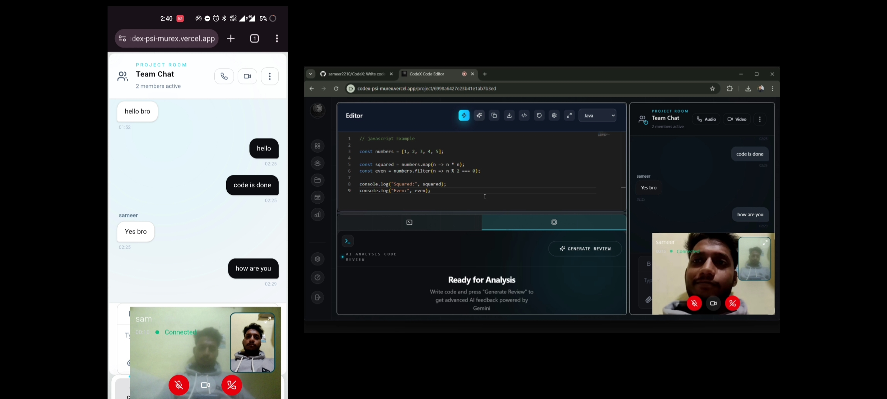
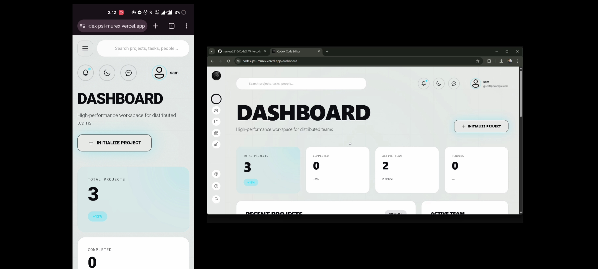
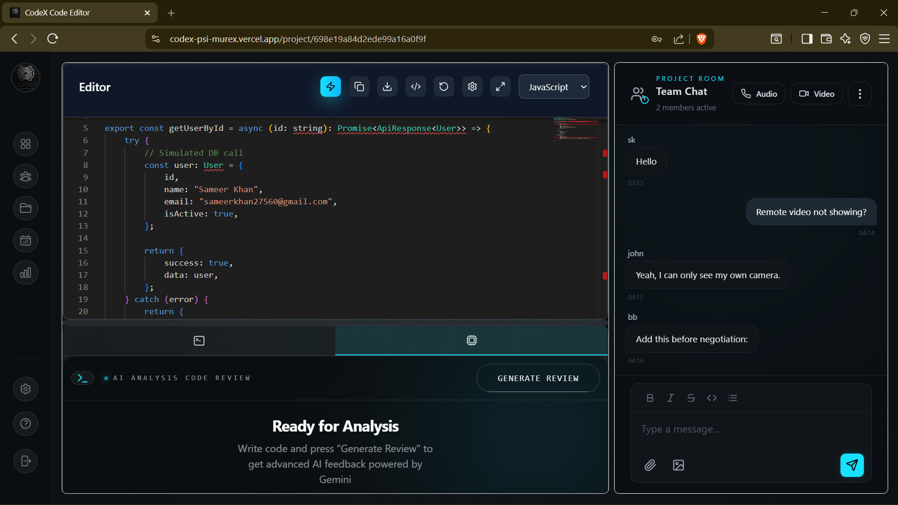
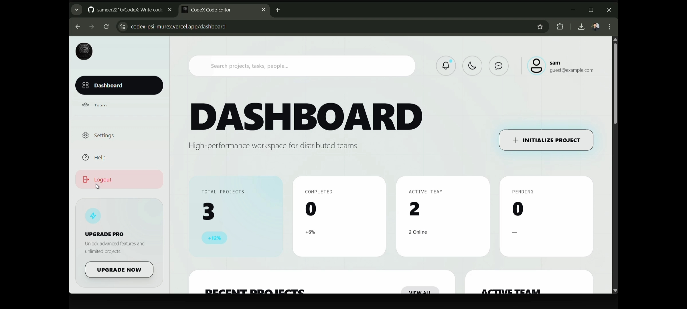

# CodeX - Collaborative AI-Powered Code Editor

<p align="center">
  
</p>

## Project Overview

CodeX is a collaborative code workspace built for teams that need shared editing, live communication, and AI-powered feedback. It pairs a React + Vite frontend with an Express backend, MongoDB storage, Socket.IO collaboration, and Google Gemini code review integration.

Teams can create projects, join shared rooms, collaborate on code in real time, send messages inside project rooms, execute JavaScript code on the server, and request AI review for project code.

The app includes authenticated dashboards, project rooms, live presence tracking, and WebRTC signaling support for audio/video call workflows.

## Notes from repository scan

- The repository contains screenshot and demo assets in `public/`.
- A hosted live deployment URL is not confirmed in source files.
- The existing README referenced a YouTube demo and deployment link that are not verifiable from the codebase.

[](https://reactjs.org/)
[](https://nodejs.org/)
[](https://socket.io/)
[](https://ai.google.dev/)

## Live link - https://codex-psi-murex.vercel.app/

## Demo video asset

[](https://youtu.be/gB7qztH9BIg?si=hfeuMXsqUXkxoAHT)

Direct link: https://youtu.be/gB7qztH9BIg?si=hfeuMXsqUXkxoAHT

## 📸 Screenshots

<p align="center">
  
  
</p>
<p align="center">
  
  
</p>

## Tech Stack

### Frontend

| Technology           | Purpose                |
| -------------------- | ---------------------- |
| React 19             | UI framework           |
| Vite                 | Build tooling          |
| Tailwind CSS         | Styling                |
| Redux Toolkit        | State management       |
| React Router DOM     | Client-side routing    |
| @monaco-editor/react | Code editor UI         |
| Socket.IO Client     | Realtime collaboration |
| Framer Motion        | Animations             |
| React Hook Form      | Form handling          |
| Yup                  | Validation             |
| axios                | HTTP client            |
| Sonner               | Notifications          |
| Recharts             | Dashboard visuals      |

### Backend

| Technology            | Purpose                 |
| --------------------- | ----------------------- |
| Node.js               | Server runtime          |
| Express.js            | HTTP API framework      |
| Mongoose              | MongoDB object modeling |
| Socket.IO             | Realtime socket server  |
| JSON Web Tokens       | Authentication          |
| Helmet                | Security headers        |
| Morgan                | HTTP request logging    |
| @google/generative-ai | Gemini AI code review   |
| node:vm               | Sandboxed JS execution  |

### Database & Storage

| Technology | Purpose            |
| ---------- | ------------------ |
| MongoDB    | Primary data store |
| Mongoose   | Schema enforcement |

### Dev Tools & Deployment

| Tool       | Purpose                    |
| ---------- | -------------------------- |
| Vite       | Frontend development       |
| nodemon    | Backend reload             |
| ESLint     | Linting                    |
| Prettier   | Formatting                 |
| Jest       | Backend tests              |
| Vitest     | Frontend tests             |
| Playwright | E2E testing                |
| cross-env  | Cross-platform env scripts |

## Project Structure

```
CodeX/
├── Backend/
│   ├── package.json
│   ├── server.js
│   └── src/
│       ├── app.js
│       ├── config/
│       │   └── config.js
│       ├── controllers/
│       │   ├── auth.controllers.js
│       │   ├── message.controllers.js
│       │   └── project.controllers.js
│       ├── db/
│       │   └── db.js
│       ├── middlewares/
│       │   └── authMiddleware.js
│       ├── models/
│       │   ├── message.model.js
│       │   ├── project.model.js
│       │   └── team.model.js
│       ├── routes/
│       │   ├── auth.routes.js
│       │   ├── message.routes.js
│       │   ├── project.routes.js
│       │   └── webrtc.routes.js
│       ├── services/
│       │   ├── ai.service.js
│       │   ├── auth.service.js
│       │   ├── call.service.js
│       │   ├── message.service.js
│       │   └── project.service.js
│       └── tests/
│           ├── auth.test.js
│           └── project.test.js
├── Frontend/
│   ├── package.json
│   ├── index.html
│   ├── vite.config.js
│   └── src/
│       ├── App.jsx
│       ├── main.jsx
│       ├── index.css
│       ├── api/
│       │   ├── config.jsx
│       │   └── project.api.js
│       ├── components/
│       │   ├── CallingPage.jsx
│       │   ├── ErrorBoundary.jsx
│       │   ├── HUD.jsx
│       │   ├── layout/
│       │   │   ├── Layout.jsx
│       │   │   ├── Navigation.jsx
│       │   │   └── Sidebar.jsx
│       │   ├── page/
│       │   │   ├── ActiveMember.jsx
│       │   │   ├── ActiveMemberPage.jsx
│       │   │   ├── Help.jsx
│       │   │   ├── Meeting.jsx
│       │   │   ├── Notification.jsx
│       │   │   └── Settings.jsx
│       │   └── ui/
│       │       ├── Button.jsx
│       │       └── ResizableContainer.jsx
│       ├── context/
│       │   └── ThemeContext.jsx
│       ├── lib/
│       │   ├── notify.js
│       │   └── sounds.js
│       ├── routes/
│       │   └── Routes.jsx
│       ├── services/
│       │   └── dashboardService.jsx
│       ├── store/
│       │   ├── hooks.js
│       │   ├── socketMiddleware.js
│       │   ├── store.js
│       │   └── slices/
│       │       ├── authSlice.js
│       │       ├── callSlice.js
│       │       ├── projectSlice.js
│       │       └── socketSlice.js
│       ├── tests/
│       │   ├── Login.test.jsx
│       │   └── setup.js
│       ├── views/
│       │   ├── Dashboard.jsx
│       │   ├── Landing.jsx
│       │   ├── NotFound.jsx
│       │   ├── auth/
│       │   │   ├── Login.jsx
│       │   │   └── Register.jsx
│       │   ├── create-project/
│       │   │   └── CreateProject.jsx
│       │   └── home/
│       │       └── project/
│       │           ├── Project.jsx
│       │           └── components/
│       │               ├── ChatSection.jsx
│       │               ├── CodeEditor.jsx
│       │               ├── OutputPanel.jsx
│       │               └── ReviewPanel.jsx
│       └── webrtc/
│           ├── callManager.js
│           ├── media.js
│           └── peer.js
├── public/
│   ├── code.png
│   ├── codeXDemo.mp4
│   ├── dashboard.png
│   ├── demo.png
│   ├── logo.png
│   ├── logout.png
│   └── og-image.png
├── tests/
│   ├── playwright.config.js
│   ├── e2e/
│   │   └── flow.spec.js
│   └── load/
│       └── simulation.js
├── package.json
└── Readme.md
```

## Database Models

### Project

| Field    | Type   | Notes               |
| -------- | ------ | ------------------- |
| name     | String | Required            |
| teamName | String | Required, lowercase |
| code     | String | Project source text |
| review   | String | AI review output    |

### Message

| Field     | Type     | Notes                               |
| --------- | -------- | ----------------------------------- |
| projectId | ObjectId | References `Project`                |
| teamName  | String   | Required                            |
| username  | String   | Required                            |
| message   | String   | Required                            |
| type      | String   | `user`, `system`, or `notification` |
| metadata  | Object   | Optional edit/reply tracking        |

### Team

| Field    | Type   | Notes                              |
| -------- | ------ | ---------------------------------- |
| teamName | String | Required, unique, lowercase        |
| password | String | Hashed                             |
| members  | Array  | Member objects with activity state |

## API Reference

### Auth — `/api/auth`

| Method | Endpoint                                    | Description                        |
| ------ | ------------------------------------------- | ---------------------------------- |
| POST   | `/register`                                 | Register a new team and admin user |
| POST   | `/login`                                    | Login and receive JWT              |
| GET    | `/verify`                                   | Verify current token               |
| POST   | `/logout`                                   | Logout and mark member inactive    |
| GET    | `/team/:teamName/members`                   | Get team member list               |
| PUT    | `/team/:teamName/member/:username/activity` | Update member active status        |
| GET    | `/team/:teamName/messages`                  | Fetch team messages                |

### Projects — `/api/projects`

| Method | Endpoint       | Description                    |
| ------ | -------------- | ------------------------------ |
| POST   | `/create`      | Create a new project           |
| GET    | `/get-all`     | List all team projects         |
| GET    | `/:id`         | Get project details            |
| PUT    | `/:id`         | Update project code            |
| POST   | `/:id/execute` | Execute JavaScript code        |
| POST   | `/:id/review`  | Run AI review for project code |

### Messages — `/api/messages`

| Method | Endpoint                     | Description                 |
| ------ | ---------------------------- | --------------------------- |
| GET    | `/project/:projectId`        | Fetch project chat messages |
| GET    | `/project/:projectId/unread` | Get unread message count    |

### WebRTC — `/api/webrtc`

| Method | Endpoint | Description                       |
| ------ | -------- | --------------------------------- |
| GET    | `/turn`  | Fetch STUN/TURN ICE server config |

## Pages & Routes

| Page           | Route                                           | Description                           |
| -------------- | ----------------------------------------------- | ------------------------------------- |
| Landing        | `/`                                             | Public landing page                   |
| Login          | `/login`                                        | Team login form                       |
| Register       | `/register`                                     | Team signup form                      |
| Dashboard      | `/dashboard`, `/projects`, `/team`, `/activity` | Main authenticated workspace          |
| Create Project | `/create-project`                               | New project creation page             |
| Project Room   | `/project/:id`                                  | Project collaboration and editor room |
| Meeting        | `/meeting`, `/meeting/:projectId`               | Call / meeting interface              |
| Active Members | `/active-members`                               | Team presence view                    |
| Settings       | `/settings`                                     | User settings page                    |
| Help           | `/help`                                         | Help and documentation page           |
| Notifications  | `/notifications`                                | Team notification feed                |
| Not Found      | `/not-found`                                    | 404 fallback page                     |

## Authentication & Authorization

- Auth strategy: JWT bearer tokens
- Token storage: `localStorage` under `codex_token`
- Protected frontend routes: `PrivateRoute` in `Frontend/src/routes/Routes.jsx`
- Backend protection: `verifyToken` middleware in `Backend/src/middlewares/authMiddleware.js`
- Team-scoped checks: `checkTeamAccess` middleware for team-specific auth routes
- Admin flag: `isAdmin` included in JWT payload

## Third-Party Integrations

| Service       | Purpose                              | Library                         |
| ------------- | ------------------------------------ | ------------------------------- |
| Google Gemini | AI code review generation            | `@google/generative-ai`         |
| Socket.IO     | Realtime collaboration and signaling | `socket.io`, `socket.io-client` |
| Monaco Editor | Code editor UX                       | `@monaco-editor/react`          |
| STUN/TURN     | WebRTC NAT traversal                 | Browser RTC + backend config    |
| axios         | HTTP API requests                    | `axios`                         |

## Repository Notes

- Demo and screenshot assets exist under `public/` (`demo.png`, `dashboard.png`, `code.png`, `logout.png`, `codeXDemo.mp4`).
- The old README referenced a live deployment URL and YouTube embed; those are not verifiable from repository source files and are noted as not found in code.
- The root `package.json` contains only runtime dependencies for `jsonwebtoken` and `socket.io-client`.

## 🔌 Database Models

### Project Model

```javascript
{
  name: String (required),
  teamName: String (required),
  code: String (default: ""),
  review: String (default: ""),
  timestamps: true
}
```

### Message Model

```javascript
{
  projectId: ObjectId (Project),
  teamName: String,
  username: String,
  message: String,
  type: "user" | "system" | "notification",
  metadata: { edited, editedAt, replyTo },
  timestamps: true
}
```

### Team Model

```javascript
{
  teamName: String (unique),
  password: String (hashed),
  members: [{ username, isAdmin, lastLogin, joinedAt, isActive }],
  createdAt: Date,
  updatedAt: Date
}
```

## 🚀 Getting Started

### Prerequisites

- Node.js (v18 or higher)
- MongoDB database
- Google Gemini API key

### Backend Setup

```bash
cd Backend
npm install
npm start
```

### Frontend Setup

```bash
cd Frontend
npm install
npm run dev
```

### Environment Variables

Create a `.env` file in `Backend/`:

```env
PORT=8000
MONGODB_URI=your_mongodb_connection_string
JWT_SECRET=your_jwt_secret
GOOGLE_API_KEY=your_gemini_api_key
FRONTEND_URLS=http://localhost:5173,https://your-frontend-domain.com
STUN_URLS=stun:stun.l.google.com:19302
TURN_URLS=turn:your-turn-host:3478?transport=udp,turn:your-turn-host:3478?transport=tcp
TURN_USERNAME=your_turn_username
TURN_CREDENTIAL=your_turn_credential
```

Create a `.env` file in `Frontend/`:

```env
VITE_BACKEND_URL=http://localhost:8000
```

Node VM sandboxed code execution: Present

Uses node:vm and runs user code inside a VM context with timeout in project.service.js (line 3), project.service.js (line 37), project.service.js (line 65), project.service.js (line 68), project.service.js (line 70).

STUN/TURN config for WebRTC: Present

Backend exposes ICE config in webrtc.routes.js (line 13), reads env in config.js (line 20), config.js (line 23).

Frontend uses STUN/TURN and RTCPeerConnection in peer.js (line 17), peer.js (line 20), peer.js (line 65), and fetches backend TURN config at peer.js (line 95).

Playwright + Jest + Vitest: Present

Playwright config/spec in playwright.config.js (line 1), flow.spec.js (line 1).

Jest in backend test setup/deps: package.json (line 12), package.json (line 42).

Vitest in frontend scripts/deps: package.json (line 12), package.json (line 51), setup file setup.js (line 3).

Monaco Editor: Present

Dependency in package.json (line 16).

Editor component usage and mount/commands in CodeEditor.jsx (line 2), CodeEditor.jsx (line 182), CodeEditor.jsx (line 575).

## 🔧 Development Workflow

### 1. Project Creation

1. User navigates to `/create-project`
2. Enters project name
3. Backend creates MongoDB document
4. User is redirected to project workspace

### 2. Collaborative Coding

1. Multiple users join the same project
2. Each user connects via Socket.io
3. Code changes are broadcasted to all users
4. Chat messages are synchronized in real-time

### 3. AI Code Review

1. Developer clicks "Get Review"
2. Current code is sent to Gemini AI service
3. AI analyzes code and provides feedback
4. Review is displayed in markdown

## 🧪 Testing

- Backend: `cd Backend && npm test`
- Frontend: `cd Frontend && npm run test`
- E2E: `npx playwright test` (from repo root)

## 🚀 Deployment

### Backend Deployment

- Deploy to Render, Railway, Heroku, or AWS
- Set production environment variables
- Ensure MongoDB connection is accessible

### Frontend Deployment

- Build with `npm run build`
- Deploy to Vercel, Netlify, or any static hosting
- Point `VITE_BACKEND_URL` to production API

## 🔒 Security Considerations

- JWT-based authentication
- CORS allow-list configuration
- Input validation in controllers
- Secure API key storage in environment variables

## 👨‍💻 Developer

<div align="center">

### **Sameer Khan**

_Full Stack Developer (MERN)_

[](https://portfolio-coral-two-16.vercel.app/)
[](https://www.linkedin.com/in/sameer-khan2210)
[](https://github.com/sameer2210)
[](mailto:sameerkhan27560@gmail.com)

</div>

---

**Happy Coding with CodeX! **
